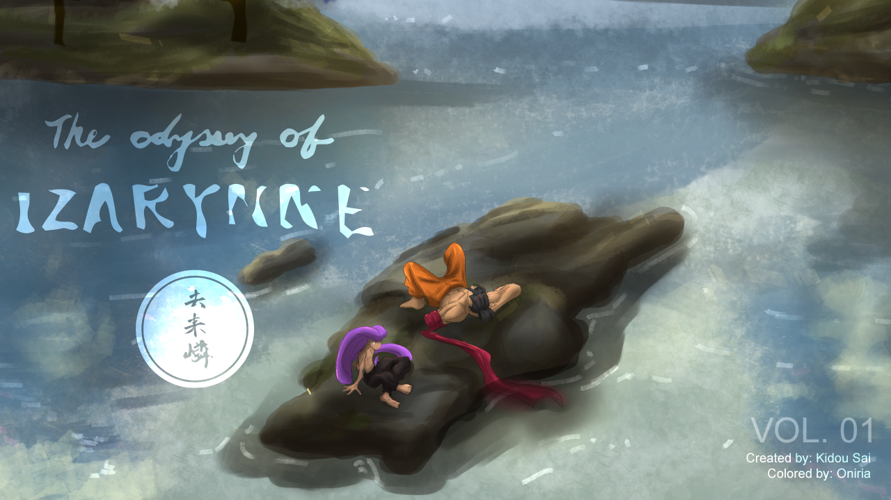

# Todoloo_Prototype
<br/>

<br/>
<br/>
<br/>

## Table of Contents
1. [Overview](#overview)
2. [Getting Started](#getting-started)
3. [Installation](#installation)

## Overview <a name="overview"></a>
>This is a prototype of a website/app designed for a comic book artist who wanted to sell their new comic book series. It was built using Gatsby and Flowbite. The app allows for users to view product details and add to an online shopping cart. While dynamic and functional, this current prototype is not connected to a shopping API yet to allow for the actual purchasing of the product.

## Getting Started <a name="getting-started"></a>

### Prerequisites
- *Node.js*
- *Gatsby*
- *npm* or *yarn*

### Installation
In the root directory, run:
```bash
npm init
npm i
```

First, run the development server:

```bash
npm run dev
# or
yarn dev
# or
pnpm dev
```

### Interface
Go to [http://localhost:3000](http://localhost:8000) in your browser to access the UI.

You can start editing the page by modifying `pages/index.js`. The page auto-updates as you edit the file.

[API routes](https://nextjs.org/docs/api-routes/introduction) can be accessed on [http://localhost:3000/api/hello](http://localhost:3000/api/hello). This endpoint can be edited in `pages/api/hello.js`.

The `pages/api` directory is mapped to `/api/*`. Files in this directory are treated as [API routes](https://nextjs.org/docs/api-routes/introduction) instead of React pages.


## Dependencies

>Flowbite
<br/>
>React
<br/>
>Tailwind
<br/>
>Typescript