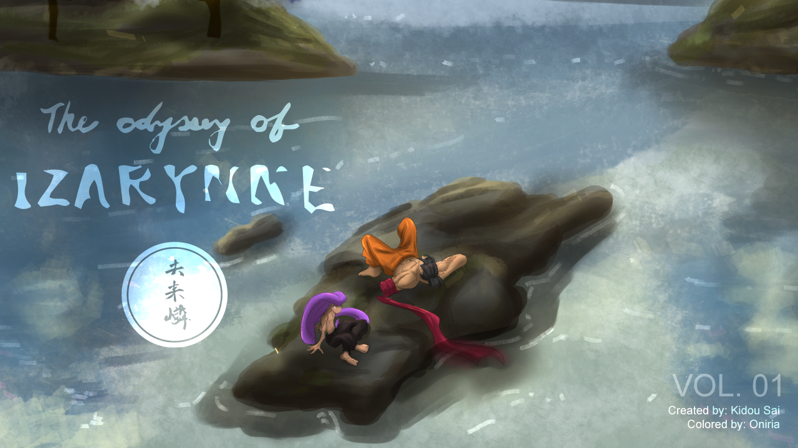

# Todoloo_Prototype
<br/>

<br/>
<br/>
<br/>

## Table of Contents
1. [Overview](#overview)
2. [Getting Started](#getting-started)
3. [Installation](#installation)

## Overview <a name="overview"></a>
>This is a prototype of a website/app designed for a comic book artist who wanted to sell their new comic book series. It was built using Gatsby and Flowbite. The app allows for users to view product details and add to an online shopping cart. While dynamic and functional, this current prototype is not connected to a shopping API yet to allow for the actual purchasing of the product.

## Getting Started <a name="getting-started"></a>

### Prerequisites
- *Node.js*
- *Gatsby*
- *npm* or *yarn*

### Installation
In the root directory, run:
```bash
npm init
npm i
```

First, run the development server:

```bash
npm run dev
# or
yarn dev
# or
pnpm dev
```

## Quick start

1.  **Open the source code and start editing!**

    You can access the site at `http://localhost:8000`

    Gatsby Note: You'll also see a second link: `http://localhost:8000/___graphql`. This is a tool you can use to experiment with querying your data. Learn more about using this tool in the [Gatsby Tutorial](https://www.gatsbyjs.com/docs/tutorial/getting-started/part-4/#use-graphiql-to-explore-the-data-layer-and-write-graphql-queries).

    Open the app directory in your code editor and edit `src/pages/index.js`. Save your changes and the browser will update in real time.


## Dependencies

>Flowbite
<br/>
>React
<br/>
>Tailwind
<br/>
>Typescript